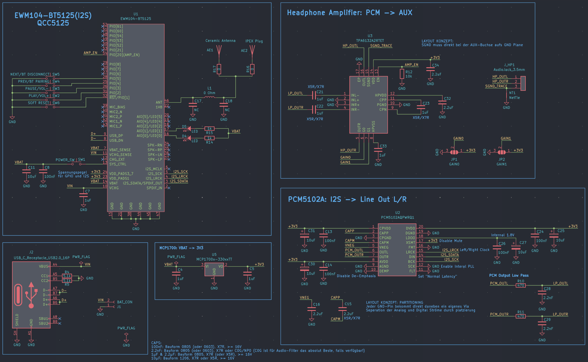

# btaudio — Audiophiles Bluetooth 5.1 Upgrade-Board für Kopfhörer

Ein kompromissloses Wireless-Upgrade-Modul für Kabelkopfhörer. Kein All-in-One-Kompromiss — stattdessen drei dedizierte Stufen für maximale Klangqualität ohne Hintergrundrauschen.

## Architektur

```
QCC5125 (BT 5.1)  →[I2S]→  PCM5102A (DAC)  →[Analog]→  TPA6132A2 (Amp)  →  Kopfhörer
   Empfang                    Wandlung                     Verstärkung
```

**Stufe 1 — Empfang:** QCC5125 empfängt High-Res-Audio via aptX HD / LDAC und gibt das Signal rein digital (I2S) weiter. Keine Funkstörungen im Analogpfad.

**Stufe 2 — Wandlung:** PCM5102A (High-End-DAC) wandelt das I2S-Signal in ein sauberes analoges Audiosignal. Dedizierter Chip statt integriertem DAC-Billigst-Lösung.

**Stufe 3 — Verstärkung:** TPA6132A2 treibt die Kopfhörer direkt an ("Capless"-Design) — keine Elektrolytkondensatoren im Signalweg, die den Klang verfärben.

## Schaltplan



## Ziel

Alte, hochwertige Kabelkopfhörer auf modernes audiophiles Bluetooth-Niveau heben — durch konsequente Trennung von Funk, DA-Wandlung und Verstärkung.

## Hardware

- **BT-Modul:** Qualcomm QCC5125 (Bluetooth 5.1, aptX HD, LDAC)
- **DAC:** Texas Instruments PCM5102A
- **Amp:** Texas Instruments TPA6132A2 (Capless Headphone Amp)
- **Design-Tool:** KiCad
